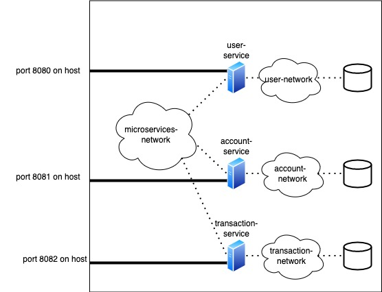

# assignment123

## 1- deployment diagram



## 2- sequence diagram


## 3- running the code

### 3-1- requirements
- linux or mac operating system
- internet access for getting docker images from dockerhub
- java 11 installed and $JAVA_HOME set
- gradle
- docker (running docker command without sudo should be possible:  sudo groupadd docker and  sudo usermod -aG docker $USER)
- docker-compose

### 3-2- run the code
for running the code you exceute the following commands.
>do not forget to run git clone with **--recursive** argument

```shell script
git clone --recursive https://github.com/p2rate/assignment123.git  
cd assignment123
chmod +x ./create_networks.sh
./create_networks.sh #needs to be run just once
chmod +x ./start_all.sh
./start_all.sh #may need to run with sudo
```
give the services a little time to start running inside the containers <br/><br/>

the bash script will do the following:
- create required docker networks
- run a mariaDb instance for each service inside docker
- build each service using gradle
- create docker images for each service
- run services on docker

## 4- browsing the endpoints
In order to check the endpoints for each service we can navigate to following pages:

swagger-ui for [user-service](http://localhost:8080/swagger-ui.html) <br />
swagger-ui for [account-service](http://localhost:8081/swagger-ui.html) <br />
swagger-ui for [transaction-service](http://localhost:8082/swagger-ui.html) <br />


## 5- testing the code

according to the flow depicted in sequence diagram, we can execute the following commands

### 5-1- get token for admin user

authenticate and get a token from user-service <br/><br/>

command:
```shell script
curl --location --request POST 'localhost:8080/api/pub/v1/login' \
--header 'Content-Type: application/json' \
--data-raw '{
    "username": "admin",
    "password": "password!!!"
}'
```
result: we reference this with $ADMIN_TOKEN for the rest of document
```
{
    "token": "Bearer eyJlbmMiOiJBMTI4R0NNIiwiYWxnIjoiUlNBLU9BRVAtMjU2In0.xS7GCnsoWyeS5-oqSZ1DlqJLurN5k6rwCnqcMtFaguOsBKfoInK7dACgQkruPy3rtTlfaAHlOJv-R9Uf0q1ggeqVNI8iYV3TBuyQPcKHgk_c3v5YWXYZxv9gjjjr4OLnAl50zY9GlyQfq9GNb2qvsw2O59RPbn-1VMRqU4ba6g8UpgdPpTmG_68C6oaFOJcn73im0hmA_e8sKJEjjUTvW7brdzt6nC1NIBb66BVGIA11fFFMUlOvlh2b8T_MkMKsaDdw2PIdAZGrlf0jom5dY6o9pWwpMtk0JIq7vsP_fzwWv8c86WNEn-MlLXjfn124pFBj_z8epOx1vR_jpiRnCg.GrBiAU7sciwY4kre.P54HHvOPsYsS-T38dZwMMpnEOEOsNnVy6MIViLknuYfvLecWX__n20PsK1CpabUqnHyAHJSJ4G63Exd_S9cbmvlI3FzEGta-ZTOyRfcNoC1eYNKRNC6K6YyIK4h8nGdJ5HKFelv2f7dCpCaQrh5gunWxW0x3gKm9MzYecsVwAJb_u8ygpCAk1lzdT7pStJLRZAob18v_c5cNoh6GzkOidvj_K78P1BHOkcmZZKDRzoSa7TRVbrs2JU_-v8AmfcOwN1EvDv-vI0G3qfGoCxG0kxHKi6K02AaaI4udDmKbOForZthqfbXoOvxnkevFXZfR-8f5JZLbSUbdPJAQYPgRtnH7TURELwu1agfPx0mnvZgH5oqdDl3TaYQAyQ.lr_1ku_Lw0BZsZ9eGK9d4Q"
}
```

### 5-2- get user_id for user1

get users info from user-service to find user1_id <br/><br/>

command: replace $ADMIN_TOKEN with real value
```shell script
curl --location --request GET 'localhost:8080/api/admin/v1/user/' \
--header 'Authorization: $ADMIN_TOKEN'
```
result: from the response get the "id" for user1. we call this $USER1_ID
```
{
    "payload": [
        {
            "id": "00febd13-113b-4c1b-82db-7d86ab370392",
            "version": 0,
            "username": "user1",
            "firstName": "user1FirstName",
            "lastName": "user1LastName",
            "email": "user@sth.com",
            "role": {
                "id": "31ab42e3-1da4-420f-9b77-175e4ffff165",
                "version": 0,
                "role": "USER",
                "permissions": [
                    {
                        "id": "a10c7832-9051-4353-b7c4-b78af8934568",
                        "version": 0,
                        "permission": "WriteLev1"
                    },
                    {
                        "id": "0300a208-499c-4eda-9d00-ab77f4206865",
                        "version": 0,
                        "permission": "ReadLev1"
                    }
                ]
            }
        },
        {
            "id": "3ab5bd1d-7476-4c5c-ba93-3308617221e2",
            "version": 1,
            "username": "admin",
            "firstName": "adminFirstName",
            "lastName": "adminLastName",
            "email": "admin@sth.com",
            "role": {
                "id": "3c2aa8bb-6679-4a0b-960e-aeb50596be70",
                "version": 0,
                "role": "ADMINISTRATOR",
                "permissions": [
                    {
                        "id": "d28b7a8e-894b-4f72-8efb-4e0dfe0bf5f5",
                        "version": 0,
                        "permission": "ReadLev3"
                    },
                    {
                        "id": "a10c7832-9051-4353-b7c4-b78af8934568",
                        "version": 0,
                        "permission": "WriteLev1"
                    },
                    {
                        "id": "d9a06c9f-47aa-482c-9899-888f76927154",
                        "version": 0,
                        "permission": "ReadLev2"
                    },
                    {
                        "id": "0300a208-499c-4eda-9d00-ab77f4206865",
                        "version": 0,
                        "permission": "ReadLev1"
                    },
                    {
                        "id": "b234d3b8-f211-4770-843c-e60ff83e7ac3",
                        "version": 0,
                        "permission": "WriteLev3"
                    },
                    {
                        "id": "b821fcca-6bd5-4d27-b5ce-c76124937b26",
                        "version": 0,
                        "permission": "WriteLev2"
                    }
                ]
            }
        }
    ],
    "status": "OK",
    "timestamp": "2022-06-10T09:51:04.235+00:00",
    "message": "OK"
}
```

### 5-3- create new account for user1

create a new account by sending a request to account-serivce using admin token <br/>

command: replace $ADMIN_TOKEN and $USER1_ID with real values
```shell script
curl --location --request POST 'localhost:8081/api/admin/v1/account' \
--header 'Authorization: $ADMIN_TOKEN' \
--header 'Content-Type: application/json' \
--data-raw '{
    "customerId": "$USER1_ID",
    "initialCredit": 100
}'

```
result: from the response get the "id" for the newly created account. we call this $ACCOUNT1_USER1_ID
```
{
    "payload": {
        "id": "faa00170-7ab0-40e9-b51d-3c10d4a675cc",
        "userId": "00febd13-113b-4c1b-82db-7d86ab370392",
        "currentAccount": true,
        "billingAddress": null
    },
    "status": "OK",
    "timestamp": "2022-06-10T09:53:43.926+00:00",
    "message": "OK"
}
```

### 5-4- get all info for user1

first we need to authenticate with user1 account. we send a request to user-service <br/><br/>
command:
```shell script
curl --location --request POST 'localhost:8080/api/pub/v1/login' \
--header 'Content-Type: application/json' \
--data-raw '{
    "username": "user1",
    "password": "password1"
}'
```

result: we call this $USER1_TOKEN
```
{
    "token": "Bearer eyJlbmMiOiJBMTI4R0NNIiwiYWxnIjoiUlNBLU9BRVAtMjU2In0.WzF1J_e57gqbixTtNNjbmXueBNIrW2UrxR6tX-cWaes5AyEWqL5x8zIkrtwVjEeM1HIxWRkRJPVehrFXA_gleLbNDYFtgFVvbJhJHvUEiOkpsSOotkhTVVF0AEhNGv08ON5E2aCl0ECyZXryBqh7PGcXycb5ocCCtHRPWrogXaFpzOCm5flxyrWD0itm5iPrkXFdB6jyxylvczDYoRe9kieRE_afsgZNN1ah07DS1N0YzzAAfB4NsExtItOGx9jtl3ww4Vzhuniowcdjq_wexozd4R2ggriD2sgFHlufIGsCWKoj9LwwqrtcoLCyYcmyToKisgJexkFxr6RMWBRl1w.ZYfY0nshh4l7A4F2.YxPpSTUSovzhrB71VuOc6CWj-JUxdOqbwMIcJtZJWvVYVaDne_JCnMzt84eOi4AyWcCVMcS_afWMejUs75PyZWircp53vxku1bVH8PeLEtFz-bPBqMsCHtbGEDgA-WTRtIgKKw5SN_j8Lcj9ibRORYdyuy5nGYjW8zVvhAHMwpno-DFsjUfaZf_QQq1aFTz8pzg2h52FPQofm8dX53poASvg8y1fZj7MnHHc7hPX5s7jWnz9dQaYUVVMNVclkrLXVUCCJ7M83SjV70v-WdrgcFpoKjRlDgX5UyHs7YKP1ye8SYo9.SFTT0XLsJf67Sd0CrmA6Ag"
}
```

then we call the endpoint on account-service to get all the info. <br/><br/>
command: replace $USER1_TOKEN with real values
```shell script
curl --location --request GET 'localhost:8081/api/v1/info' \
--header 'Authorization: $USER1_TOKEN' \
--data-raw ''

```
result:
```
{
    "payload": {
        "user": {
            "username": "user1",
            "firstName": "user1FirstName",
            "lastName": "user1LastName",
            "email": "user@sth.com"
        },
        "accounts": [
            {
                "account": "faa00170-7ab0-40e9-b51d-3c10d4a675cc",
                "balance": 100.0,
                "transactions": [
                    {
                        "fromAccount": null,
                        "toAccount": "faa00170-7ab0-40e9-b51d-3c10d4a675cc",
                        "transactionType": "DEPOSIT",
                        "amount": 100.0
                    }
                ]
            }
        ]
    },
    "status": "OK",
    "timestamp": "2022-06-10T09:54:04.125+00:00",
    "message": "OK"
}
```
## 6- stopping the code

run the following bash script located in the root of the project
```shell script
chmod +x ./stop_all.sh
./stop_all.sh
```

## 7- further more

the following needs to be added to code later:
- revoking system for issued tokens
- circuit breakers for handling other services not being available
- withdrawal and transfer functionality for transaction-service
- exception handlers for custom exceptions so that they do not 
